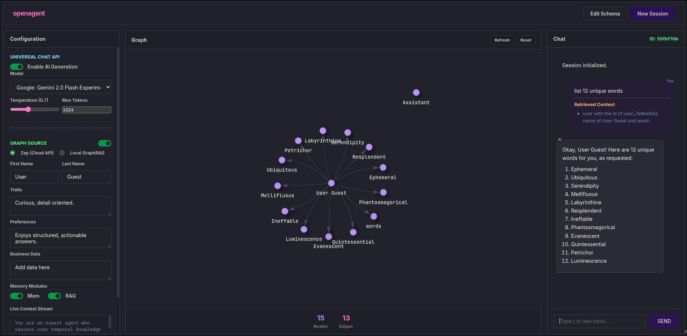

# zep-openrouter-agent

AI chat system combining **Zep's Knowledge Graph**, **Local GraphRAG**, and **OpenRouter's multi-model AI** for context-aware conversations with document retrieval.



## Technical Stack

- **Backend**: FastAPI, Python 3.10+
- **Knowledge Graph**: Zep Cloud (graph-based memory)
- **GraphRAG**: Local document retrieval with BM25 + vector search
- **Embeddings**: sentence-transformers (MiniLM, MPNet, BGE)
- **AI Models**: OpenRouter API (100+ models)
- **Search**: Hybrid (BM25Okapi + cosine similarity)
- **Compute**: CUDA/CPU support for embeddings

## Features

**Knowledge Graph**

- Persistent graph-based memory via Zep
- User preferences, traits, conversation history
- Adaptive graph generation

**GraphRAG**

- Document ingestion with chunking strategies (fixed, semantic, sentence, paragraph)
- Hybrid search (BM25 + vector similarity)
- Configurable algorithms: vector, BM25, hybrid, graph traversal
- GPU-accelerated embeddings
- Reranking support

**AI Integration**

- 100+ models via OpenRouter
- Free models: Llama, Gemini, Mistral, Phi-3, Qwen
- Configurable temperature, max_tokens

## Installation

### Using UV (Recommended)

```bash
# Install UV
curl -LsSf https://astral.sh/uv/install.sh | sh

# Clone repository
git clone <repo-url>
cd zep-openrouter-agent

# Install dependencies
uv sync

# Configure environment
cp backend/.env.example backend/.env
# Edit backend/.env with your API keys

# Run server
uv run python backend/server.py
```

## Configuration

**backend/.env**

```bash
OPENROUTER_API_KEY=  # Get from https://openrouter.ai/keys
ZEP_API_KEY=           # Get from https://www.getzep.com/
```

## Resources

- [UV Documentation](https://docs.astral.sh/uv/)
- [OpenRouter API](https://openrouter.ai/docs)
- [Zep Documentation](https://help.getzep.com/)
- [FastAPI](https://fastapi.tiangolo.com/)
